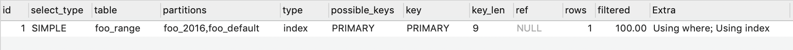

## Mysql

### 参考资料
[MySQL · 最佳实践 · 分区表基本类型](http://mysql.taobao.org/monthly/2017/11/09/)  
[分库分表的几种常见形式以及可能遇到的难](https://www.infoq.cn/article/key-steps-and-likely-problems-of-split-table)

### 分区表
innodb 每张表存储一个数据文件，使用分区表，使得单表文件分离，突破磁盘 io 限制，以达到想能提升的目的。

#### 范围分区（Range 分区）
基于一个给定连续区间的列值，将多行分配给分分区。常见的基于时间字段，基于分区的列最好是整形，若是日期类型，可使用函数转换为整形， 如：

```sql
-- 创建表时建立分区
create table foo_range (
	id int not null auto_increment,
	created DATETIME,
	primary key (id, created)
) engine = innodb partition by range (TO_DAYS(created))(
	PARTITION foo_2016 VALUES LESS THAN (TO_DAYS('2016-01-01')),
	PARTITION foo_2017 VALUES LESS THAN (TO_DAYS('2017-01-01')),
	PARTITION foo_2018 VALUES LESS THAN (TO_DAYS('2018-01-01')),
	PARTITION foo_2019 VALUES LESS THAN (TO_DAYS('2019-01-01')),
	PARTITION foo_default VALUES LESS THAN (MAXVALUE)
);

-- 修改表为分区表
alter table foo_range partition by range (TO_DAYS(created))(
	PARTITION foo_2016 VALUES LESS THAN (TO_DAYS('2016-01-01')),
	PARTITION foo_2017 VALUES LESS THAN (TO_DAYS('2017-01-01')),
	PARTITION foo_2018 VALUES LESS THAN (TO_DAYS('2018-01-01')),
	PARTITION foo_2019 VALUES LESS THAN (TO_DAYS('2019-01-01')),
	PARTITION foo_default VALUES LESS THAN (MAXVALUE)
);
-- 删除分区
alter table foo_range drop partition foo_default;
-- 新增分区
alter table foo_range add partition(
	PARTITION foo_2020 VALUES LESS THAN (TO_DAYS('2020-01-01'))
)


```
搜索结果发现分区已生效

```sql
explain select * from foo_range where created >= '2019-01-01'; 
```



#### 列表分区（List 分区）
List 分区和 range 分区类似，区别在于 list 是枚举值列表的集合，range 是连续区间值的集合。

```sql
CREATE TABLE foo_list(a int(11), b int(11)) 
partition BY list (b)( 
	partition p0 VALUES IN (1,3,5,7,9), 
	partition p1 VALUES IN (2,4,6,8,0)
);
```
#### 哈希分区(hash 分区)
基于给定的分区个数，将数据分配到不同的分区，hash 分区只能针对整数进行 hash， 非整型字段需使用表达式转换为整数。

```sql
-- hash 分区的底层实现是基于 MOD 函数
CREATE TABLE foo_hash (
    id INT NOT NULL,
    fname VARCHAR(30),
    lname VARCHAR(30),
    created DATE NOT NULL DEFAULT '1970-01-01',
    separated DATE NOT NULL DEFAULT '9999-12-31',
    job_code INT,
    store_id INT
)
PARTITION BY HASH(id)
PARTITIONS 4;

-- linear hash 分区是 hash 分区的特殊形式，其基于另一种算法，优点下数据量大的场景，增加删除合并拆分分区更快，缺点是数均分布不均匀的概率更大
CREATE TABLE foo_linear_hash (
    id INT NOT NULL,
    fname VARCHAR(30),
    lname VARCHAR(30),
    hired DATE NOT NULL DEFAULT '1970-01-01',
    separated DATE NOT NULL DEFAULT '9999-12-31',
    job_code INT,
    store_id INT
)
PARTITION BY LINEAR HASH( id )
PARTITIONS 4;
```
	
#### key 分区

key 分区与 hash 分区类似，不同点如下

* key 分区允许多列，hash 分区仅允许一列
* 在有主键或者唯一键的情况下，key 分区列不可指定，默认为主键或唯一键；没有主键和唯一键的情况下，必须显示指定列
* key 分区对象必须为列，而不能基于列表达式
* key 分区和 hash 分区的算法不同，PARTITION BY HASH (expr)，MOD取值的对象是expr返回的值，而PARTITION BY KEY (column_list)，基于的是列的MD5值。

```sql
-- 有主键的 case
CREATE TABLE foo_key1 (
    id INT NOT NULL PRIMARY KEY,    
    name VARCHAR(20)
)
PARTITION BY KEY()
PARTITIONS 2;

-- 无主键的 case
CREATE TABLE foo_key2 (
    s1 CHAR(32)
)
PARTITION BY KEY(s1)
PARTITIONS 10;
```
#### 总结
* mysql 分区中若存在主键或唯一键，则分区列必须包含在其中
* 对于原生的 range 分区，list 分区，hash 分区，分区对象返回的只能是整数值
* 分区字段不能为 null，尽量 not null；


### 分库分表
#### 垂直拆分
* 垂直分表，将表按列进行拆分成多个小表，表结构不同
* 垂直分库，将数据库按业务模块拆分多个数据库，如：用户库，订单库等

#### 水平拆分
* 水平分表，将表中不同的行按一定规律分布到不同的表中，分表数据结构相同，（merge 引擎） 
* 水平分库分表，类似水平分表，将拆分的表保存到不同的数据库中

### 分库分表带来的问题


